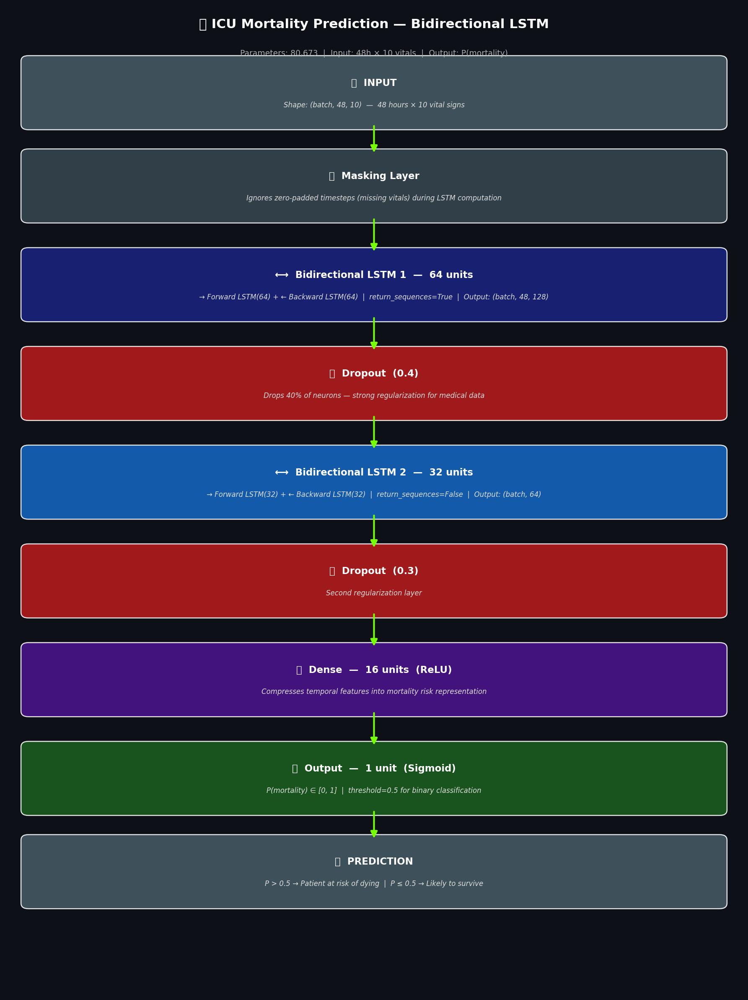
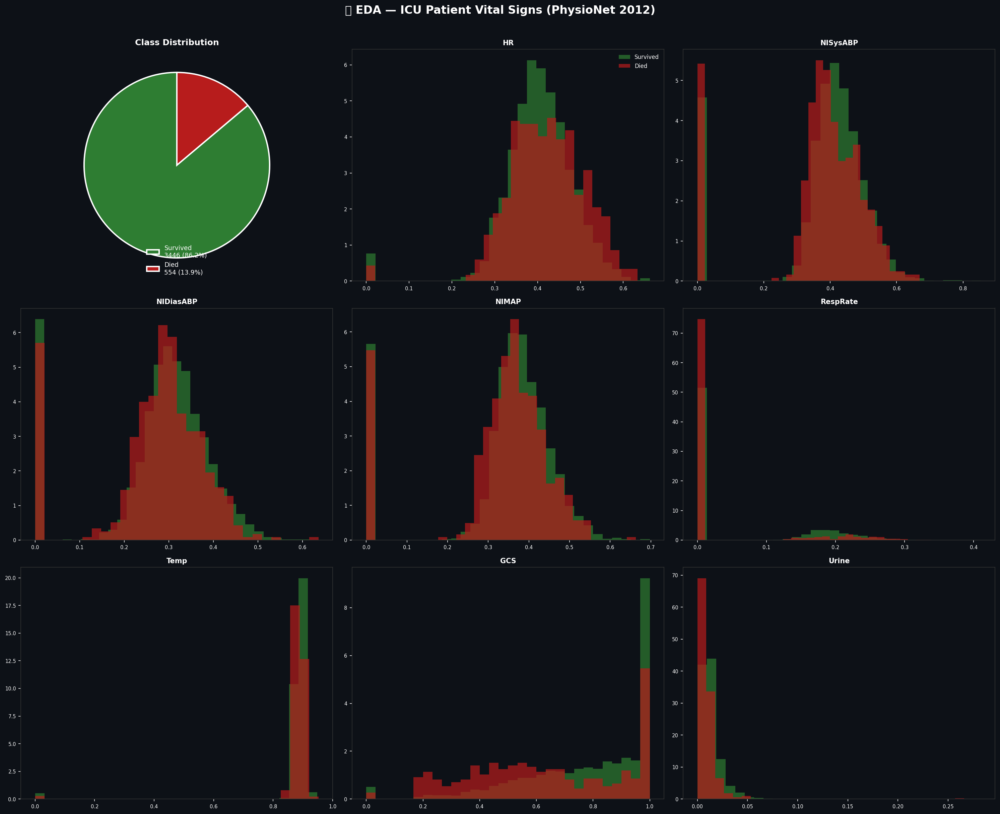
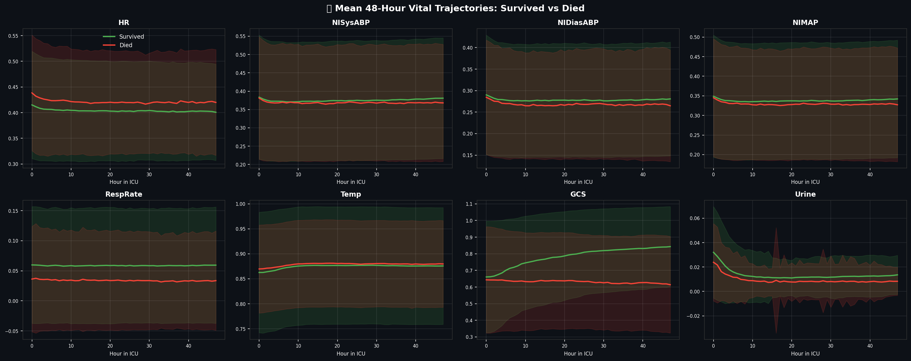

#  ICU Mortality Prediction using Bidirectional LSTM

<div align="center">


**A Bidirectional LSTM model trained on 4,000 real ICU patients that predicts in-hospital mortality from 48 hours of vital sign time series — achieving AUC-ROC of 0.8195, within the published academic research range.**

[📓 View Notebook](#) • [📊 Results](#-results) • [🏗️ Architecture](#️-model-architecture) • [📈 EDA](#-exploratory-data-analysis)

</div>

---

##  Overview

This project builds a **Bidirectional LSTM** that reads **48 hours of ICU vital signs** — heart rate, blood pressure, respiratory rate, temperature, GCS, and more — and predicts whether a patient will survive their hospital stay.

This is a **multivariate time series classification** problem on real clinical data from the **PhysioNet/Computing in Cardiology Challenge 2012**, used in dozens of published academic papers.

---

##  Key Highlights

- Parsed **4,000 individual patient files** from scratch into structured time series
- Built a **48-hour hourly grid** from irregularly sampled vital sign readings
- Achieved **AUC-ROC 0.8195** — within published research range of 0.75–0.85
- **81% recall on deaths** — catches 4 in 5 patients at risk of dying
- Handled **class imbalance** (86/14 split) using class weights (3.6× penalty on deaths)
- Used **Masking layer** to cleanly handle missing vital readings

---

##  Results

| Metric | Value | Context |
|---|---|---|
| **Test AUC-ROC** | **0.8195** | Published papers: 0.75–0.85 ✅ |
| **Death Recall** | **81%** | Catches 67/83 dying patients |
| **Surv. Precision** | **95%** | Very confident on survivors |
| **Val AUC** | 0.7924 | Monitored during training |
| **Parameters** | 80,673 | Lightweight — 315 KB |
| **Epochs** | 7 | EarlyStopping on val_AUC |
| **Training Time** | ~4s/epoch | Kaggle GPU T4 |

### Confusion Matrix (Test Set — 600 patients)

```
                  Predicted
                Survived    Died
Actual Survived   333        184
       Died         16         67
```

> The model correctly identified **67 out of 83** patients who died — with only 16 missed (false negatives). In ICU settings, minimizing false negatives is the clinical priority.

---

## Model Architecture

```
┌──────────────────────────────────────────────────────────────┐
│  INPUT  →  shape: (batch_size, 48, 10)                       │
│  48 hourly timesteps × 10 vital sign features                │
└───────────────────────────┬──────────────────────────────────┘
                            ↓
┌──────────────────────────────────────────────────────────────┐
│  MASKING LAYER                                               │
│  Ignores zero-padded timesteps (missing vitals)              │
└───────────────────────────┬──────────────────────────────────┘
                            ↓
┌──────────────────────────────────────────────────────────────┐
│  ⟷ BIDIRECTIONAL LSTM 1  —  64 units                        │
│  → Forward LSTM(64) + ← Backward LSTM(64)                   │
│  return_sequences=True  |  Params: 38,400                    │
│  Output: (batch, 48, 128)                                    │
└───────────────────────────┬──────────────────────────────────┘
                            ↓
┌──────────────────────────────────────────────────────────────┐
│  DROPOUT  (rate = 0.4)                                       │
│  Strong regularization — medical data overfits easily        │
└───────────────────────────┬──────────────────────────────────┘
                            ↓
┌──────────────────────────────────────────────────────────────┐
│  ⟷ BIDIRECTIONAL LSTM 2  —  32 units                        │
│  → Forward LSTM(32) + ← Backward LSTM(32)                   │
│  return_sequences=False  |  Params: 41,216                   │
│  Output: (batch, 64)                                         │
└───────────────────────────┬──────────────────────────────────┘
                            ↓
┌──────────────────────────────────────────────────────────────┐
│  DROPOUT  (rate = 0.3)                                       │
└───────────────────────────┬──────────────────────────────────┘
                            ↓
┌──────────────────────────────────────────────────────────────┐
│  DENSE  —  16 units  (ReLU)  |  Params: 1,040               │
│  Compresses features into mortality risk representation      │
└───────────────────────────┬──────────────────────────────────┘
                            ↓
┌──────────────────────────────────────────────────────────────┐
│  OUTPUT  —  1 unit  (Sigmoid)  |  Params: 17                │
│  P(mortality) ∈ [0, 1]                                       │
└───────────────────────────┬──────────────────────────────────┘
                            ↓
           P > 0.5  →   HIGH MORTALITY RISK
           P ≤ 0.5  →   LIKELY TO SURVIVE

Total Trainable Parameters: 80,673  (315 KB)
```



### Why Bidirectional?

A standard LSTM reads vitals only **forward** (hour 1 → 48). A Bidirectional LSTM reads **both directions simultaneously**:

- **Forward pass** → detects early warning signs building up over time
- **Backward pass** → understands final state in context of what came before

For ICU data, this means the model understands that a dropping GCS at hour 30 is more alarming if blood pressure was also declining since hour 10.

---

## Exploratory Data Analysis

### Dataset Statistics

| Property | Value |
|---|---|
| Total Patients | 4,000 |
| ICU Monitoring Window | 48 hours |
| Vital Features | 10 (HR, SysBP, DiasBP, MAP, RespRate, Temp, GCS, Urine, BUN, SpO2) |
| Survived | 3,446 (86.1%) |
| Died | 554 (13.9%) |
| Sampling | Irregular (binned to hourly grid) |

### Key EDA Finding — GCS is Most Predictive

| Vital Sign | Survived Mean | Died Mean | Difference |
|---|---|---|---|
| **GCS** | **0.784** | **0.631** | **0.152 ⚠️ HIGHEST** |
| HR | 0.404 | 0.421 | 0.018 |
| RespRate | 0.059 | 0.034 | 0.025 |
| NISysABP | 0.375 | 0.369 | 0.007 |
| Temp | 0.875 | 0.879 | 0.004 |

> **Glasgow Coma Scale (GCS)** — measuring consciousness level — showed the largest separation between survived and died patients. The 48-hour trajectory plots clearly show GCS diverging between the two groups, which is clinically valid and consistent with medical literature.




---

##  Data Pipeline

```
4,000 Raw Patient .txt Files  (Time, Parameter, Value format)
              ↓
    Parse each file → extract vitals
    Filter negatives (-1 = missing coded value)
              ↓
    Bin irregular timestamps → 48 hourly buckets
    (mean value per vital per hour)
              ↓
    Pivot → shape (48, 10) per patient
    Forward fill → Backward fill → Zero fill
              ↓
    MinMaxScaler across all patients
              ↓
    X: (4000, 48, 10)   y: (4000,)
              ↓
    Stratified Split  70% / 15% / 15%
    Train: 2801  |  Val: 599  |  Test: 600
              ↓
    Class weights: {0: 0.58, 1: 3.61}
    (3.6× penalty on missed deaths)
```

---

##  Training Configuration

| Setting | Value | Reason |
|---|---|---|
| Loss | Binary Crossentropy | Binary classification |
| Optimizer | Adam (lr=0.001) | Standard for LSTM |
| Primary Metric | AUC-ROC | Better than accuracy for imbalanced data |
| Batch Size | 64 | Balance between speed and stability |
| Class Weights | {0: 0.58, 1: 3.61} | Penalize missing deaths |
| EarlyStopping | patience=5 on val_AUC | Prevent overfitting |
| ReduceLROnPlateau | factor=0.5, patience=3 | Fine-tune near optimum |

---

##  Repository Structure

```
lstm/
├── time-series.ipynb              # Full notebook — all cells
├── README.md                      # This file
├── best_icu_bilstm.keras          # Saved model weights
├── bilstm_architecture.png        # Architecture diagram
├── eda_vitals.png                 # Vital sign distributions
├── vital_trajectories.png         # 48h trajectory plots
├── evaluation_dashboard.png       # ROC + confusion matrix
└── icu_summary_dashboard.png      # Final summary dashboard
```

---

##  Tech Stack

| Tool | Version | Usage |
|---|---|---|
| Python | 3.12 | Core language |
| TensorFlow | 2.19.0 | BiLSTM model |
| Keras | Built-in | Layers, callbacks, metrics |
| NumPy | 2.0.2 | Array ops, sequence building |
| Pandas | Latest | Patient file parsing |
| Scikit-learn | Latest | Scaling, metrics, class weights |
| Matplotlib + Seaborn | Latest | All visualizations |
| Kaggle GPU T4 | — | Training accelerator |

---

##  Talking Points

**"Why Bidirectional LSTM over standard LSTM?"**
> Standard LSTM only sees past context. BiLSTM reads forward AND backward — for ICU vitals, this means it understands that a dangerous reading at hour 30 is worse if vitals were already declining since hour 5.

**"How did you handle class imbalance?"**
> The dataset is 86/14 (survived/died). I used `compute_class_weight('balanced')` which gave a 3.6× penalty on death predictions. This shifts the model toward higher recall on the minority class — clinically, missing a death is far worse than a false alarm.

**"Why AUC-ROC instead of accuracy?"**
> A naive model that always predicts "survived" gets 86% accuracy but 0% death recall — useless clinically. AUC-ROC measures the model's ability to rank a dying patient above a surviving one, regardless of threshold. Our 0.82 AUC means the model correctly ranks 82% of such pairs.

**"What does the Masking layer do?"**
> ICU data is irregularly sampled — not every patient has readings every hour. After binning to hourly grids and forward-filling, some hours are still zero. The Masking layer tells the LSTM to skip those timesteps during computation, preventing the model from learning spurious patterns from imputed zeros.

**"What was your most important feature?"**
> GCS (Glasgow Coma Scale) showed the largest difference between survived (0.784) and died (0.631) groups — a 0.152 gap, far higher than any other vital. This is clinically valid: GCS measures consciousness level and is a well-known predictor of ICU outcomes.

---

## Dataset

**PhysioNet/Computing in Cardiology Challenge 2012**  
Source: [Kaggle — Predict Mortality of ICU Patients](https://www.kaggle.com/datasets/msafi04/predict-mortality-of-icu-patients-physionet)  
Original: [PhysioNet.org](https://physionet.org/content/challenge-2012/)  
License: Open Data Commons Attribution License

> The dataset contains de-identified ICU patient records from three types of ICUs: medical, surgical, and cardiac. Each patient record includes demographics and time-series vital signs collected during the first 48 hours of ICU admission.

---

##  References

- Goldberger et al. PhysioBank, PhysioToolkit, PhysioNet (2000)
- Harutyunyan et al. *Multitask learning and benchmarking with clinical time series data* — Scientific Data (2019)
- Zhu et al. *Predicting ICU mortality by supervised bidirectional LSTM* — IJCAI Workshop (2018)

---
