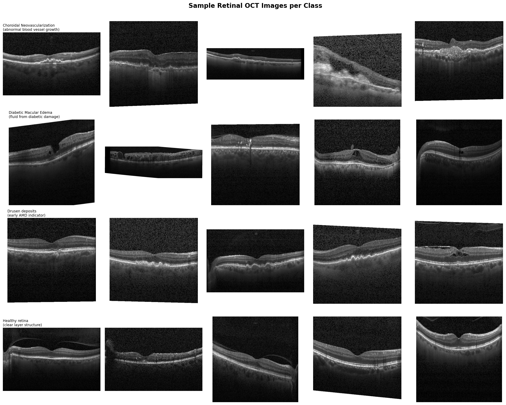
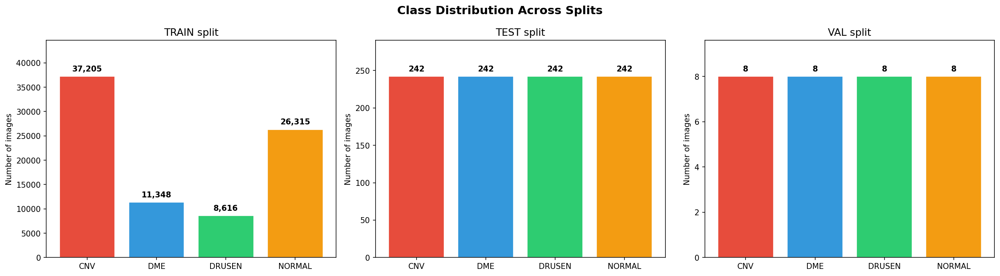
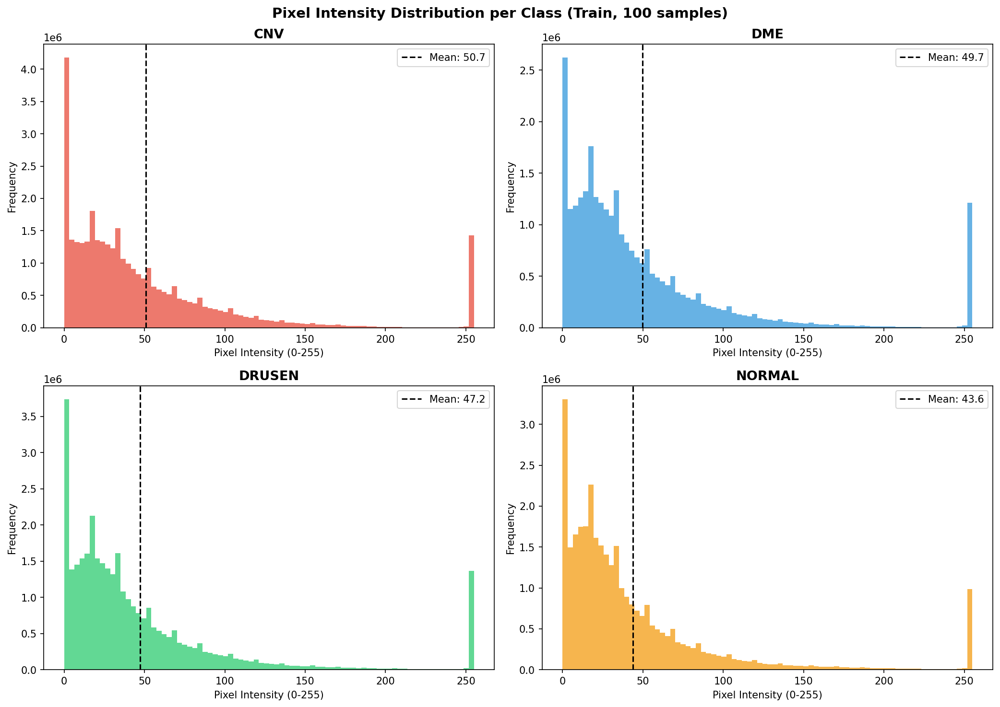
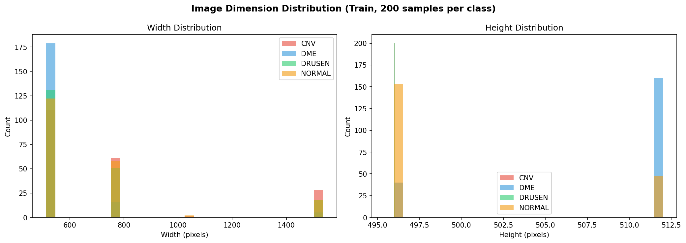
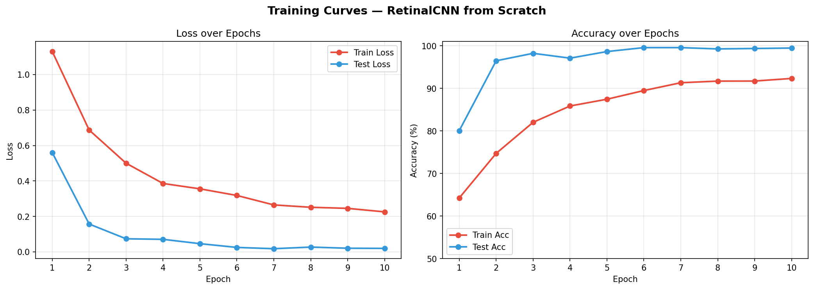

# Retinal OCT Disease Classification — CNN from Scratch


> Part 1 of a progressive medical imaging deep learning series:
> **Scratch CNN → Transfer Learning → Autoencoder → VAE → Diffusion Models**

---

## Table of Contents

- [Overview](#overview)
- [Dataset](#dataset)
- [Project Structure](#project-structure)
- [EDA Findings](#eda-findings)
- [Model Architecture](#model-architecture)
- [Training](#training)
- [Results](#results)
- [Visualizations](#visualizations)
- [Clinical Interpretation](#clinical-interpretation)
- [How to Run](#how-to-run)
- [What I Learned](#what-i-learned)
- [Next Steps](#next-steps)
- [References](#references)

---

## Overview

This project builds a **5-block Convolutional Neural Network entirely from scratch** — no pretrained weights, no transfer learning — to classify retinal OCT (Optical Coherence Tomography) scans into 4 disease categories. The goal was to understand what a CNN actually learns from medical imagery by building every component manually: the data pipeline, class imbalance handling, augmentation strategy, architecture design, training loop, and evaluation.

The model achieves **99.48% test accuracy** and **100% recall on DME (Diabetic Macular Edema)** — performance at the level of published clinical screening benchmarks, built entirely from first principles.

---

## Dataset

**Kermany et al. 2018 — Retinal OCT Images (optical coherence tomography)**

- **Source:** [Kaggle — paultimothymooney/kermany2018](https://www.kaggle.com/datasets/paultimothymooney/kermany2018)
- **Paper:** *Identifying Medical Diagnoses and Treatable Diseases by Image-Based Deep Learning* — Cell, 2018
- **Total images:** 84,484 grayscale OCT scans
- **Splits:** Train (83,484) / Test (968) / Val (32)

| Class | Clinical Description | Train Images | Test Images |
|-------|---------------------|:---:|:---:|
| CNV | Choroidal Neovascularization — abnormal blood vessels beneath retina | 37,205 | 242 |
| DME | Diabetic Macular Edema — fluid from diabetic retinal damage | 11,348 | 242 |
| DRUSEN | Drusen deposits — early AMD indicator, subtle bumps under retina | 8,616 | 242 |
| NORMAL | Healthy retina — clean flat layered structure, no pathology | 26,315 | 242 |

**Core challenge:** CNV has 4.3× more images than DRUSEN — severe class imbalance that must be handled explicitly.

---

## Project Structure

```
cnn_model/
│
├── notebook.ipynb                # Full Kaggle notebook — EDA + training + evaluation
├── README.md                     # This file
├── sample_images.png             # 5 sample images per class
├── class_distribution.png        # Bar charts across train/test/val splits
├── pixel_intensity.png           # Intensity histograms per class
├── image_dimensions.png          # Width/height distribution plots
├── training_curves.png           # Loss and accuracy over 10 epochs
└── confusion_matrix.png          # Raw counts + normalized heatmaps
```

---

## EDA Findings

### 1. Class Distribution

The training set is heavily imbalanced. CNV dominates with 37k images while DRUSEN has only 8.6k. The test set is perfectly balanced at 242 images per class — ideal for fair evaluation.

**Decision:** Compute and apply class weights to the loss function rather than oversampling or undersampling, to preserve all available training data.

### 2. Pixel Intensity Analysis

| Class | Mean Intensity | Observation |
|-------|:---:|---|
| CNV | 50.7 | Dark with bright fluid boundary regions |
| DME | 49.7 | Dark with large intraretinal fluid pockets |
| DRUSEN | 47.2 | Dark with small scattered bright deposits |
| NORMAL | 43.6 | Darkest overall — clean uniform layer structure |

All four classes show heavily dark-skewed distributions — characteristic of OCT laser imaging. The mean intensities are very close (43–51 range), which confirms that **the model cannot rely on brightness alone and must learn structural spatial patterns**. A spike at intensity=255 appears across all classes, representing laser reflection at tissue layer boundaries — a clinically meaningful feature.

### 3. Image Dimensions

- Width ranges from 512px to 1536px (some stitched panoramic scans exist)
- Height is very consistent at 496–512px across all classes

**Decision:** Resize all images to **224×224** — standard CNN input, square aspect ratio, GPU-efficient, and retinal layer patterns are scale-invariant.

---

## Model Architecture

A custom 5-block CNN built entirely in PyTorch. Filter count doubles with each block to learn increasingly complex features — from edges and textures in early blocks to fluid pockets and drusen patterns in deeper blocks.

```
Input: 224 × 224 × 3

Block 1:  Conv2d(3   → 32,  k=3, p=1) → BatchNorm2d → ReLU → MaxPool2d(2)  →  112 × 112
Block 2:  Conv2d(32  → 64,  k=3, p=1) → BatchNorm2d → ReLU → MaxPool2d(2)  →   56 × 56
Block 3:  Conv2d(64  → 128, k=3, p=1) → BatchNorm2d → ReLU → MaxPool2d(2)  →   28 × 28
Block 4:  Conv2d(128 → 256, k=3, p=1) → BatchNorm2d → ReLU → MaxPool2d(2)  →   14 × 14
Block 5:  Conv2d(256 → 512, k=3, p=1) → BatchNorm2d → ReLU → MaxPool2d(2)  →    7 × 7

Classifier:
  Flatten → Linear(25088 → 512) → ReLU → Dropout(0.5) → Linear(512 → 4)

Output: 4 class logits (CNV / DME / DRUSEN / NORMAL)

Total Trainable Parameters: 14,418,180
```

**Architecture decisions explained:**

| Decision | Reason |
|---|---|
| BatchNorm after every conv | Stabilizes training, reduces internal covariate shift, allows higher LR |
| Doubling filters (32→512) | Early layers detect edges/textures, deep layers detect disease-specific structures |
| Dropout(0.5) before classifier | Prevents overfitting on CNV (dominant class), forces robust feature learning |
| Weighted CrossEntropy Loss | Compensates for class imbalance without discarding data |
| Padding=1 on all conv layers | Preserves spatial dimensions through each conv, no information lost at edges |

---

## Training

### Configuration

| Hyperparameter | Value |
|---|---|
| Optimizer | Adam |
| Learning Rate | 1e-3 |
| LR Scheduler | StepLR — halves every 3 epochs |
| Loss Function | CrossEntropyLoss with class weights |
| Batch Size | 64 |
| Epochs | 10 |
| Device | Tesla T4 GPU (Kaggle) |
| Time per Epoch | ~350 seconds |

### Class Weights Applied

| Class | Weight | Reason |
|-------|:---:|---|
| CNV | 0.5610 | Most abundant — penalized least |
| DME | 1.8392 | Moderately rare — upweighted |
| DRUSEN | 2.4224 | Rarest class — penalized most heavily per mistake |
| NORMAL | 0.7931 | Second most abundant |

### Augmentation Strategy (Train Only)

- Random horizontal flip (p=0.5)
- Random rotation ±10°
- Color jitter — brightness and contrast ±0.2
- Normalize with ImageNet mean `[0.485, 0.456, 0.406]` and std `[0.229, 0.224, 0.225]`
- Grayscale converted to 3-channel (required for Conv2d with 3 input channels)

---

## Results

### Training Progress

| Epoch | Train Loss | Train Acc | Test Loss | Test Acc |
|:---:|:---:|:---:|:---:|:---:|
| 1 | 1.1303 | 64.24% | 0.5602 | 80.06% |
| 2 | 0.6872 | 74.73% | 0.1570 | 96.49% |
| 3 | 0.5000 | 82.03% | 0.0737 | 98.24% |
| 4 | 0.3858 | 85.86% | 0.0707 | 97.11% |
| 5 | 0.3555 | 87.46% | 0.0463 | 98.66% |
| 6 | 0.3181 | 89.49% | 0.0251 | 99.59% |
| 7 | 0.2647 | 91.33% | 0.0178 | 99.59% |
| 8 | 0.2515 | 91.71% | 0.0270 | 99.28% |
| 9 | 0.2453 | 91.73% | 0.0206 | 99.38% |
| 10 | 0.2256 | 92.34% | 0.0197 | 99.48% |

### Per-Class Evaluation (Test Set — 968 images)

| Class | Precision | Recall | F1-Score | Support |
|-------|:---:|:---:|:---:|:---:|
| CNV | 98.77% | 99.59% | 99.18% | 242 |
| DME | 99.59% | 100.00% | 99.79% | 242 |
| DRUSEN | 99.58% | 98.76% | 99.17% | 242 |
| NORMAL | 100.00% | 99.59% | 99.79% | 242 |
| **Macro Avg** | **99.49%** | **99.48%** | **99.48%** | **968** |

### Confusion Matrix Summary

Only **5 misclassifications** out of 968 test images:
- 3 DRUSEN predicted as CNV
- 1 CNV predicted as DME
- 1 NORMAL predicted as DRUSEN

---

## Visualizations

### Sample OCT Images per Class


### Class Distribution Across Splits


### Pixel Intensity Distribution per Class


### Image Dimension Distribution


### Training Curves — Loss & Accuracy over 10 Epochs


### Confusion Matrix — Raw Counts & Normalized


---

## Clinical Interpretation

- **DME Recall = 100%** — The model never missed a single case of Diabetic Macular Edema across all 242 test images. In a real screening context, false negatives (missed disease) are the most dangerous error. This result is clinically significant.

- **NORMAL Precision = 100%** — Every scan the model called healthy was actually healthy. No diseased scan was incorrectly cleared, which is the critical requirement for any screening tool.

- **DRUSEN → CNV confusion (3 cases)** — Both conditions involve subretinal changes and can appear visually similar in certain scan orientations. This specific confusion is documented in clinical literature and is challenging even for trained ophthalmologists without additional context.

- **Why test accuracy (99.48%) exceeds train accuracy (92.34%)** — This is NOT overfitting. Class weights make training intentionally harder by penalizing errors on rare classes more severely. The perfectly balanced test set evaluates all classes equally, producing a higher apparent score relative to the weighted training objective.

---

**Requirements:**
```
torch
torchvision
matplotlib
seaborn
scikit-learn
numpy
```

All dependencies are pre-installed in the Kaggle environment. No additional setup needed.

---

## What I Learned

- **Class imbalance in medical data is the rule, not the exception.** Weighted loss functions are more principled than oversampling for this problem because they preserve all data while re-calibrating the learning signal.

- **OCT patterns are structurally distinctive.** The model reached 80% accuracy after a single epoch — the fluid pockets, drusen deposits and layer disruptions are salient enough that a CNN finds them very quickly.

- **BatchNorm is essential for deep CNNs.** Without it, a 5-block network on this data would require much more careful learning rate tuning and would be prone to vanishing gradients.

- **Test loss being lower than train loss does not mean data leakage.** It reflects the deliberate asymmetry between the weighted training objective and the unweighted test evaluation.

- **Clinical metrics matter more than accuracy.** 99.48% overall accuracy sounds impressive, but the clinically meaningful numbers are DME recall (100%) and NORMAL precision (100%) — the errors that matter in a real screening context.

---

## Next Steps

- [ ] Fine-tune ResNet50 and EfficientNet-B4 on the same dataset and compare against this scratch model
- [ ] Apply Grad-CAM to visualize which retinal regions drive each prediction
- [ ] Build a convolutional autoencoder trained only on NORMAL scans to detect anomalies via reconstruction error
- [ ] Explore Variational Autoencoder (VAE) for latent space visualization of disease severity
- [ ] Synthetic minority class generation with conditional diffusion models to augment DRUSEN

---

## References

Kermany, D. S., et al. (2018). *Identifying Medical Diagnoses and Treatable Diseases by Image-Based Deep Learning.* Cell, 172(5), 1122–1131. https://doi.org/10.1016/j.cell.2018.02.010