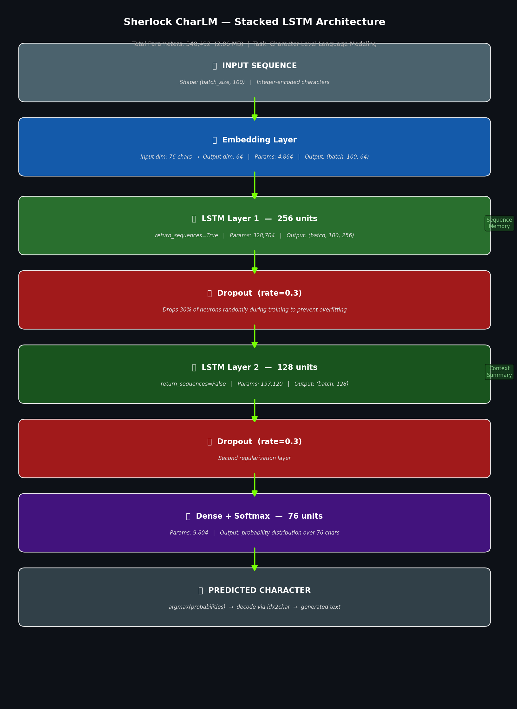
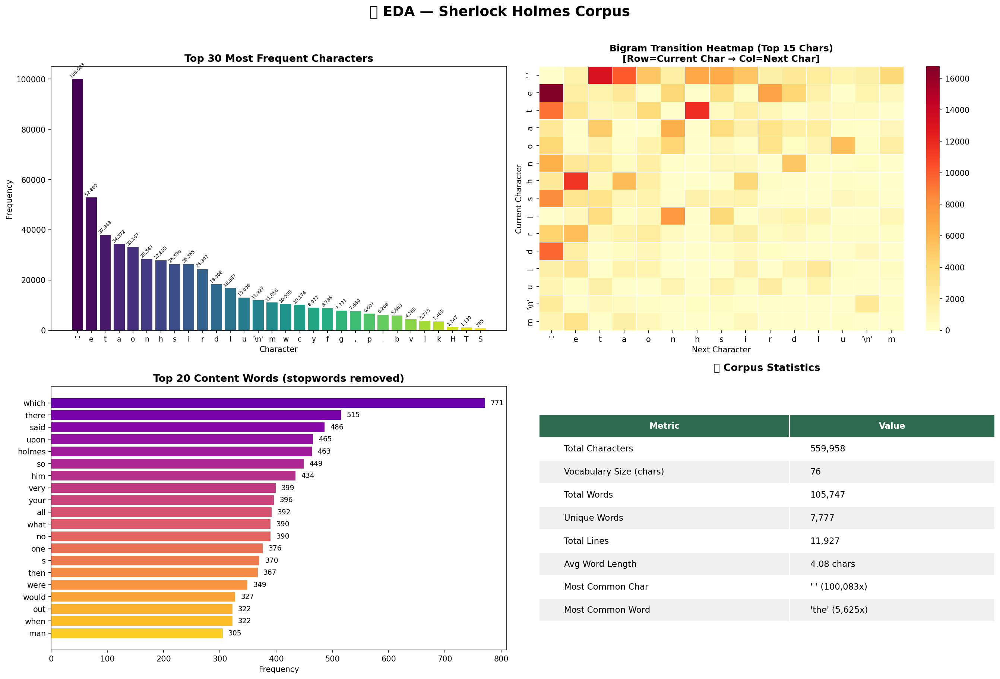
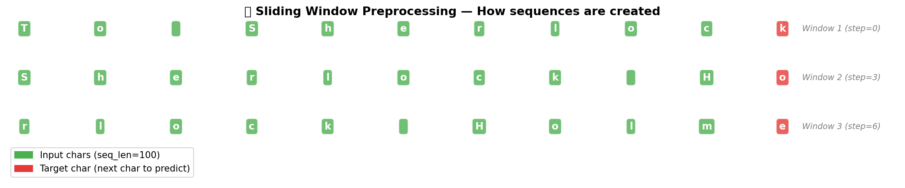

# 🔤 Character-Level Language Model using Stacked LSTM

<div align="center">


**A character-level language model trained from scratch on *The Adventures of Sherlock Holmes* — demonstrating the foundational mechanics behind modern LLMs like GPT.**

[📓 View Notebook](#) • [📊 Results](#-results) • [✍️ Generated Text](#️-sample-generated-text) • [🏗️ Architecture](#️-model-architecture)

</div>

---

## 📌 Overview

This project builds a **Stacked LSTM Language Model** that learns to generate text **one character at a time** — the same core idea that powers modern large language models, implemented from scratch.

The model is trained on **559,958 characters** from Arthur Conan Doyle's *The Adventures of Sherlock Holmes* (Project Gutenberg). Given 100 characters of context, it learns to predict the next most likely character — effectively internalizing English grammar, punctuation rules, and Doyle's distinctive Victorian writing style.

> 💡 **Why this matters for interviews:** Understanding character-level LMs gives you deep intuition into how transformers and GPT-style models work. You can explain attention, tokenization, and sequence modeling from first principles.

---

## 🎯 Key Highlights

- Built a **generative language model from scratch** — no pretrained weights, no transfer learning
- Achieved **54.38% val accuracy** on a 76-class prediction task (random baseline = 1.32%)
- **41.3× better than random** — model genuinely learned English structure and Doyle's style
- Implemented **temperature sampling** for controllable text generation
- Full pipeline: EDA → Preprocessing → Architecture → Training → Evaluation → Generation

---

## 📊 Results

| Metric | Value | Context |
|---|---|---|
| **Val Loss** | 1.5227 | Sparse Categorical Crossentropy |
| **Val Accuracy** | **54.38%** | Predicting 1 of 76 characters |
| **Perplexity** | **4.58** | Model uncertain over only ~5 chars per step |
| **vs Random Baseline** | **41.3× better** | Random = 1.32% accuracy |
| **Parameters** | 540,492 | 2.06 MB trainable weights |
| **Epochs** | 30 | EarlyStopping monitored val_loss |
| **Training Time** | ~28s/epoch | Kaggle GPU T4 |

---

## 🏗️ Model Architecture

```
┌─────────────────────────────────────────────────────┐
│  INPUT SEQUENCE  →  shape: (batch_size, 100)        │
│  Integer-encoded characters                          │
└────────────────────────┬────────────────────────────┘
                         ↓
┌─────────────────────────────────────────────────────┐
│  EMBEDDING LAYER                                     │
│  vocab(76) → dense vectors(64)  |  Params: 4,864    │
└────────────────────────┬────────────────────────────┘
                         ↓
┌─────────────────────────────────────────────────────┐
│  LSTM LAYER 1  —  256 units                          │
│  return_sequences=True  |  Params: 328,704           │
│  Learns: spelling, punctuation, short patterns       │
└────────────────────────┬────────────────────────────┘
                         ↓
┌─────────────────────────────────────────────────────┐
│  DROPOUT  (rate = 0.3)                               │
│  Drops 30% of neurons — prevents memorization       │
└────────────────────────┬────────────────────────────┘
                         ↓
┌─────────────────────────────────────────────────────┐
│  LSTM LAYER 2  —  128 units                          │
│  return_sequences=False  |  Params: 197,120          │
│  Learns: sentence structure, writing style           │
└────────────────────────┬────────────────────────────┘
                         ↓
┌─────────────────────────────────────────────────────┐
│  DROPOUT  (rate = 0.3)                               │
└────────────────────────┬────────────────────────────┘
                         ↓
┌─────────────────────────────────────────────────────┐
│  DENSE + SOFTMAX  —  76 units  |  Params: 9,804     │
│  Probability distribution over all 76 characters    │
└────────────────────────┬────────────────────────────┘
                         ↓
┌─────────────────────────────────────────────────────┐
│  OUTPUT  →  argmax → idx2char → generated character │
└─────────────────────────────────────────────────────┘

Total Trainable Parameters: 540,492  (2.06 MB)
```



---

## 📈 Training Curves

Smooth convergence over 30 epochs with **no overfitting** — train and val loss track closely throughout.


---

## 📊 Exploratory Data Analysis

Character frequency distribution, bigram transition heatmap, top content words, and corpus statistics.



---

## ⚙️ Preprocessing Pipeline

```
Raw Text (559,958 chars)
        ↓
   Clean & Normalize
        ↓
  char2idx / idx2char mapping  (vocab = 76)
        ↓
  Encode entire corpus → integer array
        ↓
  Sliding Window  (seq_len=100, step=3)
        ↓
  186,620 sequences created
        ↓
  Train / Val Split  (90% / 10%)
        ↓
  X_train: (167,958, 100)  |  y_train: (167,958,)
  X_val:   (18,662,  100)  |  y_val:   (18,662,)
```



---

## ✍️ Sample Generated Text

**Seed:** *"It was a cold winter evening when Sherlock Holmes"*

**🌡️ Temperature = 0.5** *(Conservative — safer predictions)*
```
It was a cold winter evening when Sherlock Holmes said Holmes
started the infurion of the cours. At the farther was only
strong to the part of the sing that the man was a good deal
of the street and the matter of the case...
```

**🌡️ Temperature = 1.0** *(Balanced)*
```
It was a cold winter evening when Sherlock Holmes went in
which could quies tell up. He really of the matter wish
Marain that which voint. There solutely work, but the
matter-pack to aumesty, and was immantise upon anmwant...
```

**🌡️ Temperature = 1.2** *(Creative — riskier)*
```
It was a cold winter evening when Sherlock Holmes that she
allly among Leal upon a more his wime fije was wants, and
now glam perded he was order with we short be norather in
misinplest as our fatally saw is corrimbe to it...
```

> The model invents plausible-sounding words like *"infurion"*, *"aumesty"* — it learned morphological patterns, not just memorized text.

---

## 🌡️ Temperature Sampling Explained

Temperature controls the **randomness** of predictions during generation:

```python
# Scale logits by temperature before sampling
preds = np.log(preds + 1e-8) / temperature
preds = np.exp(preds) / np.sum(np.exp(preds))
next_char = np.random.choice(vocab_size, p=preds)
```

| Temperature | Behavior | Best For |
|---|---|---|
| `< 0.5` | Very conservative, repetitive | Testing coherence |
| `0.5 – 1.0` | Balanced coherence + creativity | General use |
| `> 1.0` | Creative, unpredictable | Exploring model capacity |

---

## 🛠️ Tech Stack

| Tool | Version | Usage |
|---|---|---|
| Python | 3.12 | Core language |
| TensorFlow | 2.19.0 | Model building & training |
| Keras | Built-in | LSTM, Embedding, Dropout layers |
| NumPy | 2.0.2 | Array operations, sliding window |
| Matplotlib | Latest | All visualizations |
| Seaborn | Latest | Bigram heatmap |
| Kaggle GPU T4 | — | Training accelerator |

---

## 📁 Repository Structure

```
lstm/
├── lstm-modelling.ipynb          # Full notebook with all cells
├── README.md                     # This file
├── model_summary.txt             # Architecture text dump
├── best_sherlock_lstm.keras      # Saved model weights (Kaggle output)
├── eda_sherlock.png              # EDA visualizations
├── lstm_architecture.png         # Architecture diagram
├── sliding_window.png            # Preprocessing diagram
├── training_curves.png           # Loss & accuracy curves
└── sherlock_summary_dashboard.png # Final summary dashboard
```


## 📚 Dataset

**The Adventures of Sherlock Holmes** — Arthur Conan Doyle  
Source: [Project Gutenberg #1661](https://www.gutenberg.org/files/1661/1661-0.txt)  
License: Public Domain

---

<div align="center">

*Part of the [kaggle-notebooks](https://github.com/kumardhruv88/kaggle-notebooks) deep learning series*

</div>