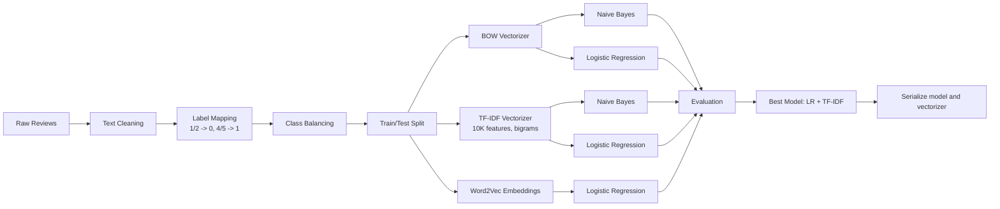
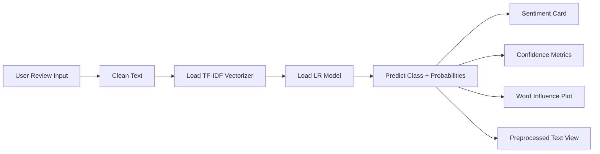

# NLP: Amazon Review Sentiment Analysis

<p align="left">
	
	
	
	
	
	
	
	
</p>

End-to-end NLP project for binary sentiment classification on Amazon Fine Food Reviews, from exploratory analysis and model benchmarking in notebook form to an interactive Streamlit app for real-time predictions.

## Project Overview

This project demonstrates a complete sentiment analysis workflow:

- Data understanding and EDA on a large-scale real-world review dataset
- Text cleaning and normalization pipeline
- Feature engineering with BOW, TF-IDF (with bigrams), and Word2Vec
- Model comparison across multiple classical ML baselines
- Deployment-ready inference with Streamlit UI

## Folder Structure

```text
nlp/
|-- .gitignore
|-- README.md
`-- amazon-sentiment-app/
	|-- amazon-data.ipynb
	|-- app.py
	|-- lr_model.pkl
	`-- tfidf_vectorizer.pkl
```

## What The Model Does

Given a user review, the app:

1. Cleans and normalizes text
2. Converts text to TF-IDF features
3. Uses a trained Logistic Regression model to predict sentiment
4. Returns:
- Predicted class: Positive or Negative
- Confidence scores for both classes
- Word-level influence chart based on LR coefficients

## Dataset

- Name: Amazon Fine Food Reviews
- Total rows: 568,454
- Columns: 10
- Source columns used for modeling: `Text`, `Score`

Labeling strategy in notebook:

- `Score` 4/5 -> Positive (1)
- `Score` 1/2 -> Negative (0)
- `Score` 3 dropped as neutral/ambiguous

Class balancing used for training:

- Original modeling set (after dropping neutral): 525,814
- Balanced set (undersampling majority class): 164,074

## Notebook Workflow (amazon-data.ipynb)

The notebook follows a clear staged pipeline:

1. Data loading and schema inspection
2. Data quality checks (missing values, distribution)
3. Exploratory analysis and review-length/statistical insights
4. Text preprocessing and cleaning functions
5. Feature engineering with BOW and TF-IDF
6. Baseline model training and evaluation
7. Model interpretability through LR coefficient analysis
8. Word2Vec experiments and comparison
9. Embedding visualization (t-SNE)
10. Final summary and model leaderboard

## Preprocessing Pipeline

Applied consistently in training and inference:

- Lowercasing
- HTML removal via regex
- Non-alphabetic character filtering
- Stopword removal (NLTK)
- Lemmatization (WordNet)

## Model Architecture

### Training Pipeline



### Inference Architecture (Streamlit App)



## Model Performance (Notebook Results)

| Model | Accuracy |
|---|---:|
| Logistic Regression + TF-IDF | 0.9046 |
| Logistic Regression + BOW | 0.8954 |
| Naive Bayes + TF-IDF | 0.8799 |
| Logistic Regression + Word2Vec | 0.8632 |
| Naive Bayes + BOW | 0.8581 |

Best selected model:

- Logistic Regression + TF-IDF
- Approx. 90.5% accuracy
- 10,000 TF-IDF features with unigram + bigram representation

## Streamlit App Features

- Professional responsive UI with theme toggle (dark default + light mode)
- Structured input/result panels
- Example review quick-fill buttons
- Real-time sentiment prediction
- Confidence visualization and class-wise metrics
- Word influence chart for interpretability

## How To Run Locally

From `nlp/amazon-sentiment-app`:

```bash
pip install streamlit numpy pandas matplotlib nltk scikit-learn
streamlit run app.py
```

If NLTK resources are not present, the app auto-downloads:

- `stopwords`
- `wordnet`
- `omw-1.4`

## Key Learnings

- TF-IDF with bigrams outperformed BOW and Word2Vec mean-pooling in this setup
- Logistic Regression offers both strong performance and interpretability
- Proper class balancing significantly improves fair sentiment classification
- Classical ML + good preprocessing can deliver production-quality baselines

## Future Improvements

- Hyperparameter optimization with cross-validation
- Aspect-based sentiment analysis (multi-aspect labels)
- Transformer fine-tuning (e.g., DistilBERT/BERT)
- MLOps packaging (versioned artifacts, API service, CI checks)

---

If you want, I can also create a second README inside `nlp/amazon-sentiment-app/` focused only on app usage and deployment (with a cleaner quick-start for recruiters and demo viewers).
