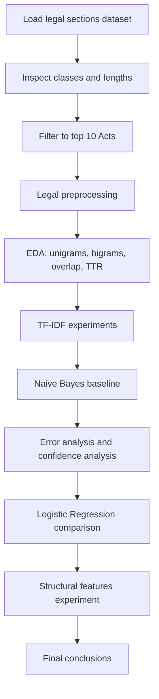
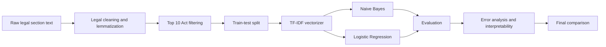
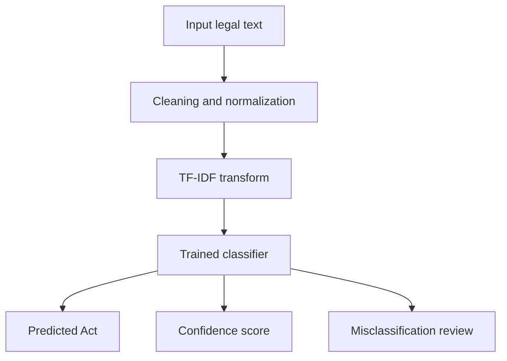

# Indian Legal Acts Text Classifier

<div align="center">
	
	
	
	
	
	
	
	
</div>

<p align="center">
	Multi-class legal text classification pipeline for Indian Acts, built from notebook exploration to model evaluation and interpretability.
</p>

<p align="center">
	
	
	
</p>

## Overview

This project classifies a section of Indian legal text into the Act it belongs to. The notebook is built as a research-style NLP workflow: it starts with dataset understanding, moves through legal-domain preprocessing and EDA, then compares Naive Bayes and Logistic Regression models on TF-IDF features, and ends with error analysis and interpretability.

The work is intentionally analytical rather than just predictive. It asks:

- Which Acts are easy or hard to separate?
- Which legal terms actually define a class?
- Does adding n-grams help or hurt?
- Can confidence scores tell us when the model is uncertain?

## Dataset

- Source: Indian Supreme Court Judgments Dataset on Kaggle
- File used: `acts_csv.csv`
- Total sections: 35,892
- Target column: `name`  
- Text column: `text`
- Problem type: multi-class classification

In the notebook, the analysis focuses on the top 10 most frequent Acts because the full label space is very large and highly imbalanced. The notebook explicitly notes that 883 classes is not practical for this baseline setup.

## What The Notebook Does

The notebook is organized as a complete NLP research pipeline:

1. Dataset understanding and class analysis
2. Legal text preprocessing
3. EDA with word frequency, n-grams, vocabulary overlap, and lexical richness
4. TF-IDF vectorization with multiple configurations
5. Naive Bayes training and evaluation
6. Error analysis on confusing Acts
7. Logistic Regression comparison
8. Structural feature augmentation
9. Final model summary and findings

## Notebook Workflow



## Data Cleaning Strategy

Legal text needs a different cleaning strategy from generic web text. The notebook preserves discriminative legal terms while removing boilerplate that appears across all Acts.

### Standard cleaning steps

- Lowercasing
- Removing numbers and section-like references
- Removing parenthetical clause markers
- Removing Roman numerals
- Stripping punctuation and special characters
- Normalizing whitespace
- Tokenizing with NLTK
- Removing stopwords
- Lemmatizing tokens

### Legal-domain stopwords

The notebook adds a custom list of legal boilerplate terms that do not help classification, such as:

- shall
- may
- section
- subsection
- provided
- notwithstanding
- accordance
- therein
- herein
- authority
- prescribed

This is one of the strongest parts of the notebook: the preprocessing is domain-aware rather than generic.

## Research Visuals And Analysis

The notebook does more than model fitting. It includes multiple analysis views:

- Top 15 Acts by section count
- Text length distributions by Act
- Top discriminative unigrams per Act
- Top bigrams per Act
- Vocabulary overlap heatmap between Acts
- Type-token ratio per Act
- Confusion matrix for the best Naive Bayes configuration
- Per-class precision/recall/F1 charts
- Misclassification deep dive
- Confidence distribution for correct vs wrong predictions

## Modeling Approach

The modeling section compares TF-IDF configurations and classifiers.

### TF-IDF experiments

The notebook tests:

- Unigrams only
- Bigrams
- Bigrams with sublinear TF scaling

### Classifiers used

- Multinomial Naive Bayes
- Logistic Regression

### Why these models

Naive Bayes is a strong, fast baseline for sparse text features. Logistic Regression is more flexible and usually learns better boundaries when legal phrases overlap across classes.

## Model Results

The notebook reports the following final performance:

| Model | Accuracy | Macro F1 |
|---|---:|---:|
| Logistic Regression + Unigram TF-IDF | 0.917 | 0.913 |
| Logistic Regression + Structural Features | 0.915 | 0.913 |
| Naive Bayes + Best TF-IDF | 0.838 | 0.829 |

### Important findings from the notebook

- Logistic Regression beats Naive Bayes on legal text.
- Unigrams were more effective than bigrams for this dataset size.
- Vocabulary overlap predicted hard confusion pairs before training.
- Delhi Municipal Corporation Act 1957 and New Delhi Municipal Council Act 1994 were the hardest pair to separate.
- Confidence scores were meaningful: wrong predictions had much lower average confidence than correct predictions.

## Architecture

### Training Pipeline



### Inference Pipeline



## Key Insight Sections From The Notebook

### Vocabulary overlap analysis

The notebook uses Jaccard similarity between Act vocabularies to predict which classes will be confused. That analysis correctly identified the Delhi vs New Delhi municipal acts as a difficult pair.

### Error analysis

The notebook does not stop at accuracy. It examines:

- the most frequent error pairs
- examples of misclassified sections
- confidence of correct vs incorrect predictions

### Structural features experiment

The notebook tests whether adding non-text features like text length and section number can fix hard classes. That experiment is useful even when it does not fully solve the issue, because it shows where the ambiguity truly comes from.

## Why This Project Stands Out

- Domain-specific legal preprocessing
- Real research-style evaluation, not just a single train/test score
- Interpretability through TF-IDF weights and class-specific terms
- Error analysis and confidence analysis
- Visual exploration of overlap and lexical richness
- Clear progression from EDA to model improvement

## Folder Structure

```text
legal news/
|-- README.md
`-- legal-news.ipynb
```

## How To Run The Notebook

Open `legal-news.ipynb` in Jupyter or VS Code and run the cells in order.

Recommended environment:

- Python 3.10+
- pandas
- numpy
- scikit-learn
- nltk
- matplotlib
- seaborn
- wordcloud

## Future Improvements

- Try character-level TF-IDF for citation-heavy sections
- Compare against linear SVM or XGBoost on sparse features
- Add sentence embeddings or transformer-based models
- Expand beyond top 10 Acts to a larger hierarchy of labels
- Turn the notebook into an interactive legal-text classifier app

## Summary

This project is a focused legal NLP pipeline that combines domain-aware preprocessing, strong baseline modeling, and careful error analysis. It shows that in legal text classification, the right cleaning strategy and interpretability tools matter as much as the classifier itself.

